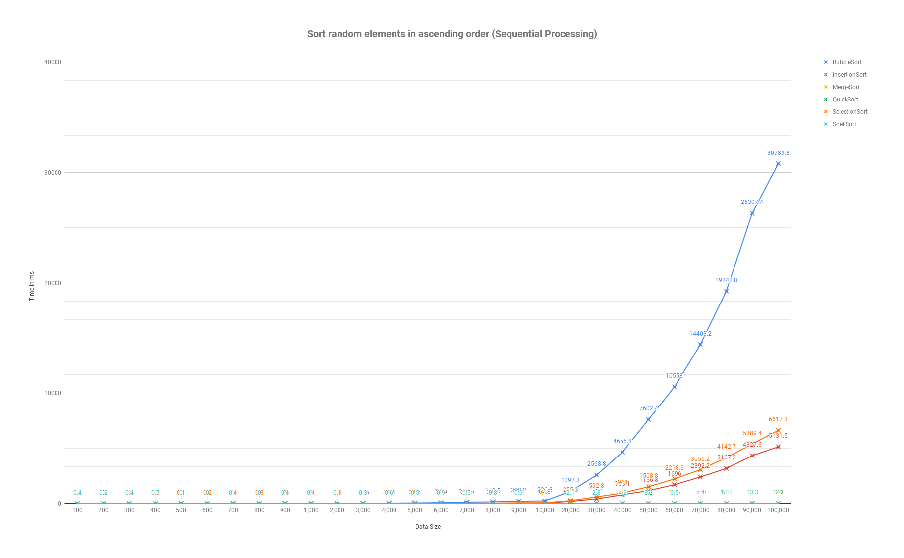

# Sorting-Algorithms 

* [Link](https://docs.google.com/spreadsheets/d/e/2PACX-1vSV9FbZm-52D0zpN28qOJVfi9IU_pwQvMwwhfEVKHUz8rM9t-AYJclo_bbodlUM8pXRVkhW1OS5HNMv/pubchart?oid=1641898593&format=interactive)
* 
* 
* 

#### Issues
* [Generic array creation](https://stackoverflow.com/questions/7131652/generic-array-creation-error/23034391)
* [How to increase java heap size in intelliJ](https://www.jetbrains.com/help/idea/increasing-memory-heap.html)
* [Increase Java stack size](https://stackoverflow.com/questions/3700459/how-to-increase-the-java-stack-size)
* Quick sort throws a stackoverflow error for sorting between 80_000 and 100_000 elements
    * [Memory efficient quick sort](https://stackoverflow.com/questions/33884057/quick-sort-stackoverflow-error-for-large-arrays)
* Image file name is better named with no spaces
